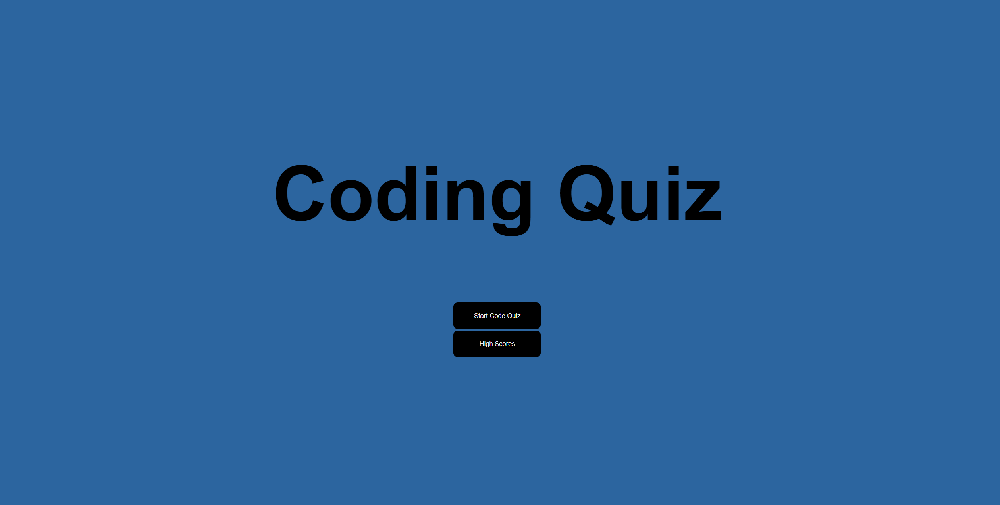
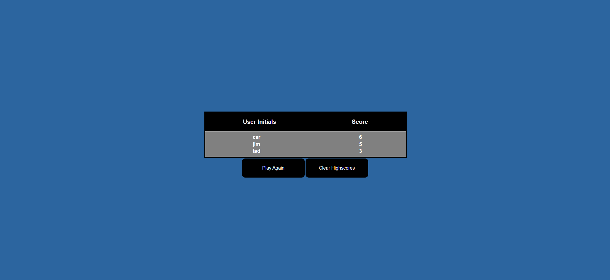

# Coding Quiz

## Description
This challenge was to create a coding quiz that has a timer and a high score board. To create the timer I used a simple function in JavaScript, to make the timer give a penalty for a wrong answer I created a penalty function with an if statement. Then to save the high scores to the webpage I used local storage. This week in bootcamp we learned a lot about web API's and how browsers can use user data to store some of their information, which is exactly what I did to store the high scores. I built this project to test my skills in JavaScript and see how clean I could make my code. I had to do some outside research to help me get started so I learned a lot about functions and how important it is to call global variables. My project stands out because I used simple styling and majority of the work in Javascript. 

## Usage
You can take the quiz yourself here [Coding Quiz](https://zencoh.github.io/quizMeBroh/)

